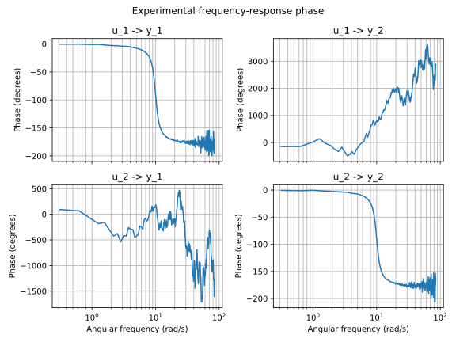

# Classic Model AMBER

Ferramentas de pesquisa para carregar, visualizar e analisar dados experimentais
de um sistema MIMO com quatro entradas, quatro perturbacoes e quatro saidas. O
repositorio tambem inclui uma estimativa de resposta em frequencia a partir dos
espectros de entrada e saida e exemplos para comparacao com modelos analiticos.

## Funcionalidades

- leitura de experimentos armazenados em arquivos de texto ou NumPy;
- separacao automatica dos sinais de entrada, perturbacao e saida;
- geracao de graficos dos sinais experimentais;
- estimativa da matriz de resposta em frequencia por FFT;
- graficos de magnitude e fase para cada relacao entrada-saida;
- analise de autocorrelacao e correlacao cruzada com decimacao configuravel;
- graficos das FFTs de perturbacoes e saidas;
- filtragem passa-baixas e analise de resposta em frequencia SISO;
- scripts MATLAB para exportar os dados originais para o formato utilizado em
  Python;
- exemplo visual que compara a estimativa experimental com uma funcao de
  transferencia conhecida.

## Estrutura

```text
.
|-- plots/                              # Graficos gerados em SVG
|-- src/
|   |-- dataset.py                     # Carga e visualizacao dos dados
|   |-- experimental_frequency_response.py
|   |-- experimental_frequency_response_siso.py
|   |-- freq_resp.py                   # Analise MIMO com dados experimentais
|   |-- freq_resp_siso.py              # Analise SISO com dados experimentais
|   |-- utils.py                       # Interpolacao para visualizacao
|   `-- utils/                         # Conversao e dados auxiliares MATLAB
|-- tests/
|   |-- 00_compute_exp_freq_resp.py    # Comparacao visual da resposta
|   `-- 01_read_csv.py                 # Leitura de CSV do dSPACE
|-- requirements.txt
`-- README.md
```

O diretorio `data/` nao e versionado porque os arquivos experimentais podem
ocupar varios gigabytes.

## Instalacao

Crie um ambiente virtual e instale as dependencias fixadas no repositorio:

```bash
python -m venv .venv
source .venv/bin/activate
python -m pip install --upgrade pip
python -m pip install -r requirements.txt
```

## Formato dos dados

Os arquivos de texto devem ser separados por virgula e conter 13 colunas nesta
ordem:

| Colunas | Conteudo |
| --- | --- |
| 1 | tempo |
| 2 a 5 | quatro entradas de corrente |
| 6 a 9 | quatro perturbacoes |
| 10 a 13 | quatro saidas |

Coloque os arquivos em `data/`. Ao receber, por exemplo,
`../data/chirp.txt`, `Dataset.load()` procura primeiro por
`../data/chirp.npz`. Se o cache nao existir, o arquivo de texto inteiro e
carregado e um arquivo NPZ com as chaves `t`, `i`, `d` e `y` e criado no mesmo
diretorio.

Os scripts em `src/utils/` convertem resultados MATLAB para essa organizacao de
colunas. Eles devem ser executados com o diretorio de trabalho ajustado para que
os caminhos relativos apontem para `data/`.

Os CSVs exportados pelo dSPACE podem conter cabecalhos e uma linha
`trace_values`; `Dataset.load()` localiza essa linha, reorganiza as colunas de
perturbacao e saida para a convencao do projeto e cria um cache `.npz` ao lado
do CSV. Os arquivos brutos e os caches permanecem fora do versionamento.

## Uso

### Visualizacao de um conjunto de dados

O exemplo em `dataset.py` usa `data/chirp.txt`. Execute-o a partir de `src/`,
pois o caminho do arquivo de entrada e relativo ao diretorio de trabalho:

```bash
cd src
python dataset.py
```

Para ambientes sem interface grafica:

```bash
cd src
MPLBACKEND=Agg python dataset.py
```

Os graficos de entrada, perturbacao e saida sao gravados em `plots/`.

`Dataset.plot_crosscorrelation()` e `Dataset.plot_autocorrelation()` geram
correlacoes com os sinais decimados. `Dataset.compute_fft()` gera as magnitudes
das FFTs de perturbacoes e saidas. Esses metodos exigem que o conjunto tenha
sido carregado e gravam os SVGs em `plots/`.

### Resposta em frequencia

`ExperimentalFrequencyResponse` recebe uma lista de experimentos por entrada
excitada. Cada matriz de entrada ou saida deve ter os sinais nas linhas e as
amostras nas colunas. O metodo `compute()` calcula, para cada par entrada-saida,

```text
S_uu = U * conj(U) / N
S_yu = Y * conj(U) / N
G = S_yu / S_uu
```

O `Dataset` segue o mesmo padrao: `i`, `d` e `y` sao armazenados como
`(n_sinais, n_amostras)`. Os arquivos CSV e TXT permanecem em formato tabular,
com uma amostra por linha; a transposicao ocorre durante o carregamento.

O exemplo principal cria um sistema MIMO sintetico de duas entradas e duas
saidas, excita uma entrada por experimento e gera os diagramas de magnitude e
fase:

```bash
cd src
python experimental_frequency_response.py
```

O argumento `max_freq` de `plot_freq_resp()` e os valores armazenados em
`angular_frequencies` usam radianos por segundo.

Exemplos dos resultados versionados:




## Verificacao

Verifique a formatacao do codigo Python com:

```bash
python -m black --check src tests
```

O arquivo `tests/00_compute_exp_freq_resp.py` e um script de comparacao visual,
nao um teste automatizado com assercoes. Ele pode ser executado a partir da raiz
do repositorio:

```bash
MPLBACKEND=Agg python tests/00_compute_exp_freq_resp.py
```

Esse script constroi uma matriz DFT densa. Com os 20.000 pontos configurados no
exemplo, somente essa matriz pode consumir cerca de 3,2 GB de memoria. Evite
executa-lo em maquinas com memoria limitada.

Os scripts `src/freq_resp.py` e `src/freq_resp_siso.py` executam analises sobre
arquivos experimentais reais. O segundo aplica filtragem passa-baixas, recorta
os experimentos e calcula a resposta SISO media. Eles dependem dos dados locais
em `data/` e podem exigir varios gigabytes de memoria; nao sao testes
automatizados.
