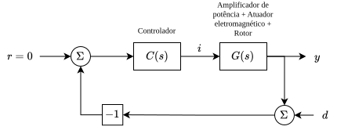
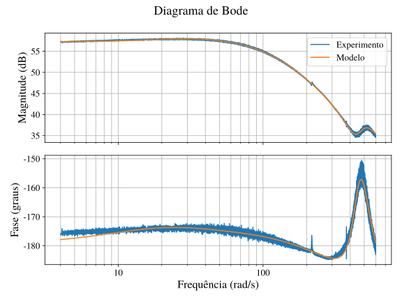
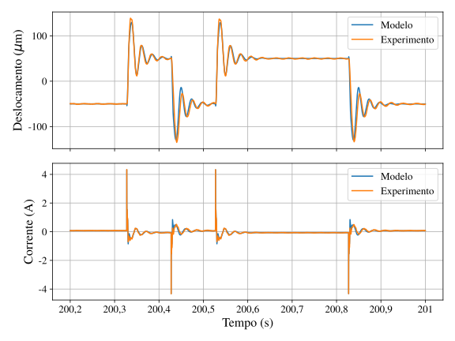

# Modelagem baseada em dados de um Mancal Magnético Ativo

Ferramentas de pesquisa para processamento de dados experimentais, identificação
em frequência e modelagem de um sistema rotativo com mancais magnéticos ativos.
O repositório reúne fluxos em Python e MATLAB para:

- carregar experimentos exportados em TXT, CSV ou NPZ;
- organizar sinais de tempo, corrente, perturbação e deslocamento;
- visualizar os sinais experimentais e suas correlações;
- estimar respostas em frequência MIMO e SISO;
- filtrar e recortar ensaios experimentais;
- calcular respostas de malha aberta a partir de respostas de malha fechada;
- comparar resultados experimentais com modelos dinâmicos;
- construir um modelo reduzido de rotor usando a biblioteca ROSS;
- ajustar ganhos de um modelo MIMO às respostas experimentais;
- realizar identificação adicional usando MATLAB.

Este é um repositório de análise científica e desenvolvimento de modelos. Não é
um pacote Python instalável e não possui uma API pública estável, pipeline de CI
ou uma suíte de testes automatizados.

## Sumário

- [Visão geral](#visão-geral)
- [Resultados da modelagem do eixo V13](#resultados-da-modelagem-do-eixo-v13)
- [Dados experimentais](#dados-experimentais)
- [Estrutura do repositório](#estrutura-do-repositório)
- [Requisitos](#requisitos)
- [Instalação](#instalação)
- [Como executar](#como-executar)
- [Formato dos dados](#formato-dos-dados)
- [Módulos Python](#módulos-python)
- [Scripts MATLAB](#scripts-matlab)
- [Fluxos de análise](#fluxos-de-análise)
- [Arquivos gerados](#arquivos-gerados)
- [Verificação e limitações](#verificação-e-limitações)
- [Notas sobre unidades](#notas-sobre-unidades)

## Visão geral

O projeto foi desenvolvido para analisar ensaios de um sistema rotor-mancal. Os
dados podem conter quatro entradas de corrente, quatro sinais de perturbação e
quatro saídas de deslocamento. Algumas análises usam todos os canais, enquanto
outras isolam os eixos `V13` e `W13` para obter respostas SISO.

Os fluxos principais são:

1. **Aquisição e preparação:** leitura dos arquivos experimentais, conversão do
   formato tabular para matrizes NumPy e criação de caches NPZ.
2. **Análise temporal:** visualização dos sinais, autocorrelação, correlação
   cruzada e espectros de perturbações e saídas.
3. **Identificação em frequência:** estimação da função de transferência pela
   razão entre densidades espectrais de potência cruzada e de entrada.
4. **Análise de malha aberta:** transformação de respostas medidas em malha
   fechada usando o controlador conhecido.
5. **Modelagem:** construção de um rotor no ROSS, redução modal e ajuste dos
   ganhos do modelo às respostas de malha aberta.

## Resultados da modelagem do eixo V13

Esta seção reúne os resultados obtidos na modelagem da relação entre a corrente
de controle e o deslocamento do eixo `V13`. A identificação foi realizada a
partir da resposta de frequência experimental de malha aberta e posteriormente
validada no domínio do tempo.

### Bancada experimental

A figura abaixo mostra a bancada utilizada para a aquisição dos dados
experimentais do sistema rotor-mancal magnético ativo.


### Estrutura do ensaio

O diagrama a seguir exemplifica a estrutura da malha e o ponto de injeção do
sinal de perturbação. O sinal aplicado pode ser um chirp ou um PRBS, conforme o
ensaio realizado. Nesta configuração, a perturbação é utilizada para obter a
resposta do sistema entre a corrente de controle e o deslocamento no eixo `V13`.

<p align="center">
  
</p>

### Identificação em frequência

A resposta em frequência experimental de malha aberta foi comparada com a
resposta calculada a partir da função de transferência identificada. A
comparação é apresentada abaixo.



A função de transferência identificada para a relação entre corrente de controle
e deslocamento do eixo `V13` foi:

$$
G(s) = -9595{,}5\,
\frac{
    (s - 1989)(s + 19{,}7)
    (s^2 + 128{,}5s + 1{,}981 \times 10^5)
}{
    (s + 144{,}4)(s - 123{,}9)(s + 24)
    (s^2 + 175{,}5s + 2{,}392 \times 10^5)
}
$$

Na expressão acima, `s` representa a variável complexa de Laplace. O sinal
negativo do ganho e os polos e zeros devem ser preservados ao utilizar o modelo
em simulações ou comparações posteriores.

### Validação no domínio do tempo

A validação temporal compara, simultaneamente, o deslocamento e a corrente de
controle produzidos pelo modelo com os sinais obtidos experimentalmente. O
resultado alcançou um ajuste aproximado de **98%** entre modelo e experimento.



O resultado indica que a função de transferência reproduz adequadamente o
comportamento observado no ensaio utilizado para validação. A qualidade do
ajuste deve, contudo, ser reavaliada quando forem alterados o eixo, a faixa de
frequência, o sinal de excitação ou as condições operacionais.

## Dados experimentais

Os dados brutos e os caches do diretório `data/` **não são versionados**. O
diretório é explicitamente ignorado pelo Git, pois os arquivos experimentais
ocupam muitos gigabytes e não podem ser carregados no GitHub de forma adequada.
Na cópia de trabalho utilizada durante o desenvolvimento, o diretório `data/`
ocupa aproximadamente 18 GB.

Os dados necessários para reproduzir as análises deverão ser baixados do Google
Drive e extraídos para o diretório `data/` na raiz do repositório:

```text
classic_model_amber/
└── data/
    ├── chirp_v13_0.npz
    ├── chirp_v13_1.npz
    ├── ...
    └── T_w13_frequency_response_open_loop.npz
```

> **Link para os dados:** https://drive.google.com/drive/folders/1uutkXg48eP29wKkETOdD1jOUqjHeuJTR?usp=sharing

Depois de baixar os arquivos, confirme que os caminhos relativos usados pelos
scripts estão corretos. Os scripts Python devem, em geral, ser executados a
partir de `src/`, onde `../data` aponta para o diretório de dados da raiz.

Não adicione arquivos de `data/` ao Git. Além do tamanho, esses arquivos podem
conter dados experimentais originais que devem ser distribuídos separadamente.

## Estrutura do repositório

```text
.
├── data/                                  # Dados locais, ignorados pelo Git
├── files/                                 # Figuras dos resultados da modelagem
├── plots/                                 # Figuras SVG/PNG geradas pelas análises
├── requirements.txt                       # Dependências Python fixadas
├── main.py                                # Fluxo combinado de análises V13/W13
├── README.md                              # Esta documentação
└── src/
    ├── dataset.py                         # Carga, conversão e visualização
    ├── utils.py                           # Interpolação de sinais
    ├── experimental_frequency_response.py
    │                                       # Resposta em frequência MIMO
    ├── experimental_frequency_response_siso.py
    │                                       # Resposta em frequência SISO
    ├── experimental_open_loop_frequency_response_siso.py
    │                                       # Conversão de malha fechada para aberta
    ├── freq_resp_siso.py                   # Entrada para dados reais SISO
    ├── ol_freq_resp_siso.py                # Entrada para malha aberta SISO
    ├── build_mimo_model_from_frequency_response.py
    │                                       # Rotor ROSS e ajuste do modelo MIMO
    ├── write_data_to_txt.m                 # Conversão de dados MATLAB para TXT
    └── freq_ident.m                        # Identificação de função de transferência
```

O diretório `plots/` contém resultados gráficos versionados ou gerados
localmente. A execução de um script pode substituir figuras existentes com o
mesmo nome.

## Requisitos

### Python

- Python compatível com as versões das dependências em `requirements.txt`;
- NumPy, SciPy, pandas e Matplotlib para processamento e visualização;
- `control` para funções de transferência e respostas em frequência;
- `ross-rotordynamics` para o modelo de rotor;
- `black` para formatação;
- `loguru` para mensagens de execução.

O arquivo `requirements.txt` contém uma lista extensa e fixada de dependências,
incluindo pacotes auxiliares de Jupyter, documentação, visualização e análise.

### MATLAB

Os scripts MATLAB exigem uma instalação do MATLAB com as ferramentas usadas
pelos arquivos, especialmente as funções de identificação, como `idfrd` e
`tfest`. Eles não são necessários para executar os fluxos Python básicos.

## Instalação

Na raiz do repositório, crie e ative um ambiente virtual:

```bash
python -m venv .venv
source .venv/bin/activate
python -m pip install --upgrade pip
python -m pip install -r requirements.txt
```

No Windows, a ativação normalmente é feita com:

```powershell
.venv\Scripts\Activate.ps1
```

Os scripts foram escritos como scripts de pesquisa, e não como um pacote
instalável. Por isso, os imports locais e os caminhos padrão dependem do
diretório de trabalho.

## Como executar

### Regra geral de diretório

Para os scripts localizados em `src/`, execute a partir de `src/`:

```bash
cd src
MPLBACKEND=Agg python dataset.py
```

O parâmetro `MPLBACKEND=Agg` é útil em servidores ou ambientes sem interface
gráfica. Em uma máquina com interface, ele pode ser omitido para permitir que as
figuras sejam exibidas.

### Visualização e análise de um conjunto de dados

Com os dados disponíveis em `data/`, execute:

```bash
cd src
MPLBACKEND=Agg python dataset.py
```

O exemplo interno carrega `../data/chirp_v13_0.csv` e executa:

- `Dataset.load()`;
- `Dataset.plot()`;
- `Dataset.plot_crosscorrelation()`;
- `Dataset.plot_autocorrelation()`;
- `Dataset.compute_fft()`.

As figuras são salvas em `plots/`.

### Exemplo MIMO sintético

O módulo de resposta em frequência MIMO possui um exemplo sintético que cria um
sistema de duas entradas e duas saídas, aplica sinais chirp e compara a resposta
estimada com o sistema simulado:

```bash
cd src
MPLBACKEND=Agg python experimental_frequency_response.py
```

Esse exemplo não depende dos dados experimentais do diretório `data/`, mas pode
consumir bastante memória devido ao processo de interpolação e às operações FFT.

### Resposta em frequência SISO com dados reais

O script `freq_resp_siso.py` processa os ensaios `V13` e `W13`. Ele carrega os
experimentos, aplica filtro passa-baixas, reamostra/recorta os sinais, calcula a
resposta em frequência média e gera os gráficos:

```bash
cd src
MPLBACKEND=Agg python freq_resp_siso.py
```

Esse fluxo espera arquivos como `chirp_v13_0`, `chirp_v13_1` e
`chirp_w13_1` em formato TXT, CSV ou NPZ. Os nomes exatos usados pelo script
podem ser ajustados conforme a disponibilidade dos dados locais.

### Resposta de malha aberta

Depois que as respostas SISO de malha fechada forem calculadas, execute:

```bash
cd src
MPLBACKEND=Agg python ol_freq_resp_siso.py
```

O script processa `T_v13` e `T_w13`. Para cada ensaio, ele:

1. carrega `T_*_frequency_response.npz`;
2. avalia a resposta do controlador;
3. calcula a resposta de malha aberta;
4. salva `T_*_frequency_response_open_loop.npz`;
5. gera gráficos do controlador e da resposta de malha aberta;
6. avalia uma função objetivo associada à remoção de atraso.

### Fluxo combinado

`main.py` reúne os fluxos de resposta em frequência de malha fechada e aberta
para `V13` e `W13`. Como ele está na raiz e importa módulos localizados em
`src/`, execute-o configurando o caminho de módulos:

```bash
PYTHONPATH=src MPLBACKEND=Agg python main.py
```

Esse fluxo é mais pesado e depende de vários arquivos já processados no
diretório `data/`. Para depuração, prefira executar os scripts individuais.

### Construção e ajuste do modelo MIMO

O modelo de rotor depende do ROSS e das respostas de malha aberta de `V13` e
`W13`:

```bash
cd src
MPLBACKEND=Agg python build_mimo_model_from_frequency_response.py
```

O script carrega as respostas abertas, monta uma resposta MIMO diagonal, cria um
modelo de rotor com redução modal, compara o modelo com os dados experimentais e
otimiza os ganhos de rigidez e corrente com `scipy.optimize.least_squares`.

Esse fluxo pode exigir grande quantidade de memória e tempo de processamento.
Ele também depende de versões compatíveis do ROSS, SciPy e python-control.

## Formato dos dados

### Arquivos TXT

Arquivos TXT devem ser separados por vírgula e possuir uma amostra por linha,
com 13 colunas na seguinte ordem:

| Coluna | Sinal |
| --- | --- |
| 1 | tempo `t` |
| 2 a 5 | quatro entradas de corrente `i` |
| 6 a 9 | quatro perturbações `d` |
| 10 a 13 | quatro saídas `y` |

Ao carregar um TXT, `Dataset` armazena os dados como:

```text
t: (n_amostras,)
```

O carregamento de um TXT procura primeiro um arquivo NPZ com o mesmo nome. Se o
cache não existir, o TXT é carregado e um arquivo `.npz` é criado ao lado dele.

Exemplo:

```python
from dataset import Dataset

dataset = Dataset("../data/chirp_v13_0.txt")
t, i, d, y = dataset.load()
```

### Arquivos CSV do dSPACE

Os CSVs exportados pelo dSPACE podem conter cabeçalhos antes da linha
`trace_values`. O carregador:

- localiza a linha `trace_values`;
- ignora a primeira coluna textual de cada linha de dados;
- converte os valores restantes para `float64`;
- valida a existência de 13 colunas numéricas;
- reorganiza perturbações e saídas para a convenção do projeto;
- salva um cache NPZ ao lado do CSV.

O arquivo é aberto com a codificação `cp1252`, compatível com os CSVs esperados
do dSPACE.

Exemplo:

```python
from dataset import Dataset

dataset = Dataset("../data/chirp_v13_0.csv")
t, i, d, y = dataset.load()
```

### Arquivos NPZ

Esse é o formato preferencial para reexecuções, pois evita reler e reconverter
arquivos tabulares grandes.

### Respostas em frequência

As respostas SISO salvas pelos scripts possuem as chaves:

```text
angular_frequencies
response
```

Os arquivos gerados normalmente são:

```text
T_v13_frequency_response.npz
T_w13_frequency_response.npz
T_v13_frequency_response_open_loop.npz
T_w13_frequency_response_open_loop.npz
```

As frequências angulares estão em radianos por segundo e as respostas são
complexas.

## Módulos Python

### `src/dataset.py`

Define a classe `Dataset`, responsável pela entrada e pelo diagnóstico inicial
dos dados experimentais.

Principais responsabilidades:

- carregar NPZ diretamente;
- carregar TXT e gerar cache NPZ;
- carregar CSVs do dSPACE e gerar cache NPZ;
- separar tempo, corrente, perturbação e saída;
- plotar sinais de entrada, perturbação e saída;
- calcular e plotar correlação cruzada;
- calcular e plotar autocorrelação;
- calcular e plotar FFTs das perturbações e saídas.

Os métodos de correlação aplicam decimação configurável. Isso reduz o custo
computacional para arquivos com muitos milhões de amostras.

### `src/utils.py`

Fornece funções de interpolação para visualização:

- `interpolate_signal_siso()` para um sinal unidimensional;
- `interpolate_signals_mimo()` para uma matriz de sinais;
- `interpolate_signals()` como despachante para os dois casos.

As funções interpolam os sinais para uma malha de até um milhão de pontos. Isso
produz gráficos mais suaves, mas também aumenta o uso de memória; não são
necessárias para os cálculos fundamentais da resposta em frequência.

### `src/experimental_frequency_response.py`

Implementa `ExperimentalFrequencyResponse`, usada para análise MIMO. A classe
recebe listas de experimentos, cada uma contendo:

- vetor de tempo;
- matriz de entradas;
- matriz de saídas.

Cada entrada deve ser excitada em um experimento. O método `compute()` estima a
resposta entre cada entrada e cada saída por:

```text
S_uu = U * conj(U) / N
S_yu = Y * conj(U) / N
G    = S_yu / S_uu
```

O resultado é armazenado em dicionários indexados por relações como
`u_1 -> y_2`. O módulo também oferece filtro passa-baixas e gráficos dos dados,
da resposta em frequência, da magnitude e da fase.

### `src/experimental_frequency_response_siso.py`

Implementa `ExperimentalFrequencyResponseSiso`, destinada a um único par
entrada-saída. A classe:

- recebe vários ensaios SISO;
- pode reamostrar os sinais para um passo temporal médio;
- recorta o início e a duração útil do experimento;
- filtra a saída com filtro Butterworth passa-baixas;
- calcula a média dos espectros de entrada e saída entre experimentos;
- salva a resposta em frequência em NPZ;
- gera gráficos temporais, de magnitude e de fase.

O cálculo médio é feito a partir de:

```text
S_uu_mean = mean(S_uu de cada ensaio)
S_yu_mean = mean(S_yu de cada ensaio)
G         = S_yu_mean / S_uu_mean
```

O parâmetro `cutoff_frequency` é interpretado na unidade de frequência usada
pelo método de filtragem, enquanto os gráficos da resposta utilizam frequência
angular em rad/s.

### `src/experimental_open_loop_frequency_response_siso.py`

Implementa `ExperimentalOpenLoopFrequencyResponseSiso`. A classe carrega uma
resposta SISO de malha fechada e aplica o controlador definido em
`get_controller()`.

Para a convenção adotada no projeto, a resposta aberta é calculada por:

```text
G(jw) = -T(jw) / (C(jw) * (1 + T(jw)))
```

O módulo restringe a análise ao intervalo angular entre 4 e 600 rad/s, salva a
resposta aberta em NPZ e cria gráficos do controlador, da resposta aberta e da
função objetivo de atraso.

Os parâmetros do controlador estão codificados no módulo. Alterações nesses
parâmetros devem ser feitas com cuidado, pois mudam diretamente os resultados
experimentais derivados.

### `src/freq_resp_siso.py`

É o ponto de entrada para calcular respostas SISO de malha fechada usando dados
experimentais reais. Possui funções separadas para os ensaios `V13` e `W13`.

O fluxo inclui filtragem, recorte, geração de gráficos e cálculo da resposta
SISO. Os nomes e índices dos canais são definidos no próprio script.

### `src/ol_freq_resp_siso.py`

É o ponto de entrada para derivar as respostas de malha aberta de `V13` e `W13`.
Ele pressupõe que os arquivos de resposta de malha fechada já existam em
`data/`.

### `src/build_mimo_model_from_frequency_response.py`

Define o modelo físico e reduzido do rotor usando ROSS. Suas responsabilidades
incluem:

- construir eixo, discos e mancais;
- obter matrizes de massa, amortecimento e rigidez;
- calcular modos e frequências naturais;
- projetar o modelo no subespaço modal;
- montar um modelo de espaço de estados;
- calcular a resposta em frequência do modelo;
- comparar as respostas `V13` e `W13` com os dados experimentais;
- otimizar ganhos `K_x` e `K_i`.

O modelo contém parâmetros geométricos e físicos específicos do rotor estudado.
Ele não deve ser interpretado como um modelo genérico sem a validação dos dados
experimentais correspondentes.

### `main.py`

Orquestra os principais fluxos de malha fechada e malha aberta para `V13` e
`W13`. É útil para uma execução completa, mas é menos adequado para depuração
porque executa várias análises consecutivas e depende de muitos arquivos locais.

## Scripts MATLAB

### `src/write_data_to_txt.m`

Converte uma estrutura MATLAB de ensaio para uma matriz tabular. O script:

- carrega uma variável de experimento;
- extrai tempo, correntes, perturbações e deslocamentos;
- plota os quatro canais de cada grupo;
- escreve uma matriz com 13 colunas em `txt_data/`.

O nome do arquivo e a variável carregada são definidos no início do script e
precisam ser ajustados para cada experimento.

### `src/freq_ident.m`

Executa uma identificação de função de transferência no MATLAB. Ele:

- carrega `open_loop_frequency_responses.txt`;
- cria um objeto `idfrd`;
- ajusta uma função de transferência de ordem 5 com `tfest`;
- compara a resposta medida e a identificada;
- salva dados de frequência em `ident_freq_v13_freq.txt`;
- simula respostas temporais para comparação com dados PRBS;
- salva os resultados temporais em `ident_freq_v13_time.txt`.

Esse script depende de arquivos gerados pelo fluxo Python e de dados PRBS
disponíveis localmente.

## Fluxos de análise

### 1. Preparar os dados

1. Baixe os dados do Google Drive.
2. Extraia os arquivos para `data/`.
3. Confirme que os nomes esperados pelos scripts estão presentes.
4. Ative o ambiente virtual Python.

### 2. Inspecionar um ensaio

Use `Dataset` para verificar dimensões, sinais e gráficos antes de executar uma
identificação:

```python
from dataset import Dataset

dataset = Dataset("../data/chirp_v13_0.npz")
t, i, d, y = dataset.load()
print(t.shape, i.shape, d.shape, y.shape)
dataset.plot()
dataset.plot_crosscorrelation()
dataset.plot_autocorrelation()
dataset.compute_fft()
```

Esse exemplo deve ser executado com `src/` no caminho de importação ou a partir
do diretório `src/`.

### 3. Calcular a resposta SISO

Execute `freq_resp_siso.py`. O resultado primário é salvo como NPZ e pode ser
reutilizado sem repetir o processamento dos sinais brutos.

### 4. Calcular a resposta de malha aberta

Execute `ol_freq_resp_siso.py` após o passo anterior. Os arquivos gerados podem
ser usados pelo modelo MIMO e pelo script MATLAB de identificação.

### 5. Ajustar o modelo MIMO

Execute `build_mimo_model_from_frequency_response.py` depois de garantir que as
duas respostas de malha aberta estejam em `data/`. O script também escreve uma
representação tabular combinada em `open_loop_frequency_responses.txt`.

## Arquivos gerados

### Em `data/`

- caches NPZ derivados de TXT e CSV;
- respostas SISO de malha fechada;
- respostas SISO de malha aberta;
- resposta MIMO combinada em TXT;
- resultados auxiliares para identificação MATLAB.

Esses arquivos permanecem fora do versionamento.

### Em `plots/`

Dependendo do fluxo executado, podem ser criados:

- gráficos de corrente, perturbação e saída;
- gráficos de dados filtrados;
- gráficos de dados recortados;
- magnitude e fase da resposta em frequência;
- resposta do controlador;
- resposta de malha aberta;
- função objetivo para avaliação de atraso;
- comparação entre resposta experimental e modelo;
- mapas de polos e zeros;
- FFTs, autocorrelações e correlações cruzadas.

As figuras são predominantemente SVG. Alguns fluxos MATLAB também podem gerar
PNG ou SVG, dependendo da configuração da instalação.

## Verificação e limitações

Não existe atualmente uma suíte de testes automatizados com asserções. A
execução de um script de análise confirma apenas que aquele fluxo conseguiu
rodar com os dados e dependências disponíveis.


Para verificar a formatação Python:

```bash
python -m black --check src main.py
```

Para formatar os arquivos Python:

```bash
python -m black src main.py
```

### Verificação de sintaxe

```bash
python -m compileall src main.py
```

### Uso de memória

Alguns fluxos usam FFTs diretas, interpolação densa ou matrizes grandes. Eles
podem consumir vários gigabytes de RAM. Em particular:

- não execute todos os fluxos como smoke test em uma máquina limitada;
- prefira um único experimento durante o desenvolvimento;
- use os caches NPZ quando disponíveis;
- evite criar várias figuras de alta resolução simultaneamente;
- execute análises reais em uma máquina com memória suficiente.

### Dependência dos dados

Os scripts que processam dados reais falham se os arquivos esperados não
estiverem em `data/`. A instalação das dependências, isoladamente, não torna o
repositório reproduzível sem o conjunto de dados fornecido separadamente.

### Ambiente gráfico

A maioria dos scripts chama `plt.show()` quando executada diretamente. Em
servidores sem display, use:

```bash
MPLBACKEND=Agg python <script>.py
```

## Notas sobre unidades

- `angular_frequencies` é expressa em radianos por segundo (`rad/s`).
- Os limites `min_freq` e `max_freq` usados nos gráficos de resposta em
  frequência também são limites em `rad/s`.
- Frequência de amostragem e passo temporal são obtidos a partir do vetor `t`.
- O eixo de frequência dos gráficos de FFT em `Dataset.compute_fft()` usa a
  frequência associada ao passo temporal do sinal.
- Comprimentos do modelo ROSS são convertidos para metros quando necessário.
- As unidades físicas dos sinais dependem do ensaio e devem ser confirmadas na
  documentação da aquisição antes de comparar amplitudes.
